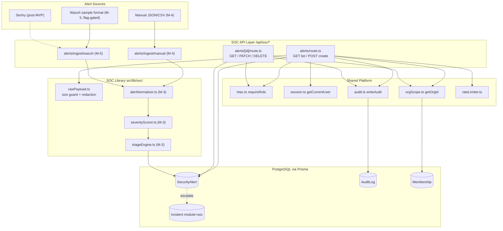
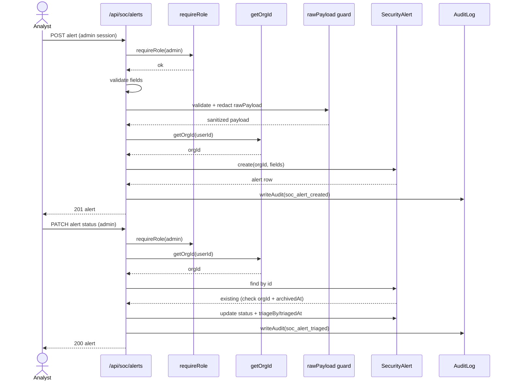
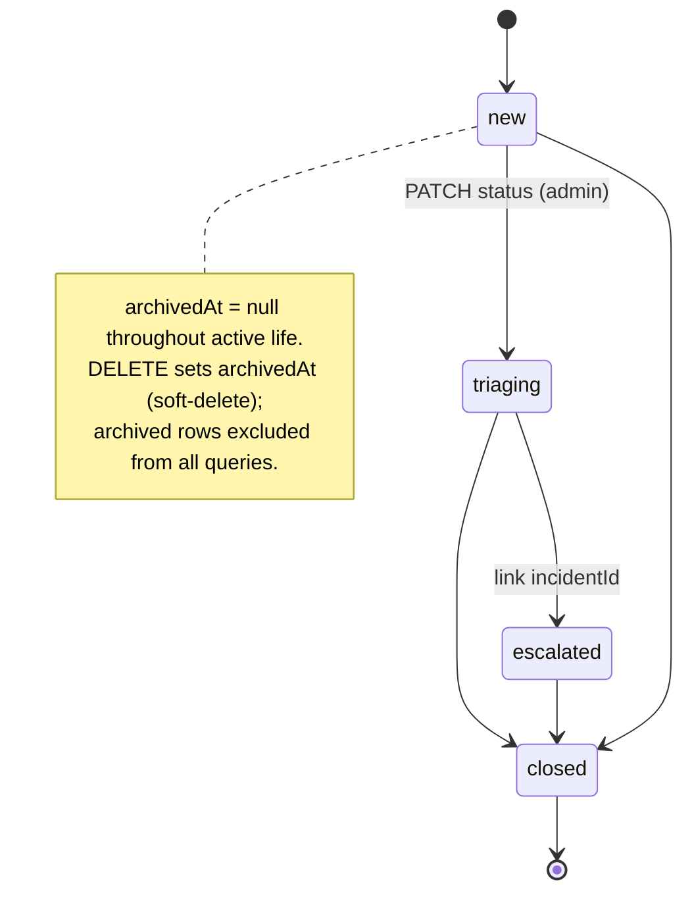

# SOC Module — Architecture & Data Flow

**Version:** 1.0
**Date:** 2026-06-20
**Companion:** `SOC_MODULE_PRD.md`, `SOC_MODULE_TRD.md`, `SOC_IMPLEMENTATION_CONFORMANCE.md`

All diagrams below are validated Mermaid (render-checked). Boxes annotated with `(M-n)` are planned for that milestone and not yet built; everything unmarked is implemented in M-1/M-2.

---

## 1. Component Architecture

How alert sources, the `/api/soc/*` layer, the SOC library, the shared platform, and the database relate. Solid arrows are implemented call paths (M-2); dotted arrows are planned (M-3+) or post-MVP.



**Boundary rules (enforced):**
- All SOC routes live under `/api/soc/*`; no SOC logic leaks into Coder routes.
- Every SOC DB query is scoped by `orgId` from `getOrgId(session.userId)`.
- `Incident` is shared but discriminated: SOC rows carry `module='soc'`; Coder queries never see them without the filter.
- `rawPayload` is redacted and size-capped before storage and is never rendered as HTML.

---

## 2. Data Flow — Create & Triage (M-2)

The implemented request path for creating an alert and then triaging it. Both operations require an `admin` session, resolve `orgId`, and write to the immutable audit log.



**Cross-org / archived handling:** if the fetched row's `orgId` does not match the caller's org, or `archivedAt` is set, the route returns **404** (not 403) to avoid leaking existence across tenants.

---

## 3. SecurityAlert Status Lifecycle

The 4-state lifecycle (locked in the TRD). Soft-delete via `archivedAt` is orthogonal to status — an alert in any status can be archived, after which it disappears from all queries.



**Triage recording:** the first transition away from `new` stamps `triageBy` (the acting admin's userId) and `triagedAt`. Subsequent transitions do not overwrite them.

---

## 4. Module separation at the data layer

```
Task        ── module='coder' (default) ─────────────▶ Coder queries
            └─ module='soc'  ──────────────────────────▶ (reserved; SOC remediation tasks, post-MVP)

Incident    ── module='coder' (default) ─────────────▶ Coder incident queries
            └─ module='soc' + alertId ─────────────────▶ SOC incident queries (M-8)

SecurityAlert ── orgId-scoped, archivedAt-filtered ──▶ SOC alert queries (M-2)
```

Every read path applies the discriminator (`module`) and/or tenant scope (`orgId`) so the two product modules never observe each other's rows.

---

## 5. Diagram source

These diagrams are maintained as Mermaid in this file. To re-validate after edits, render the fenced blocks above (all three were validated: flowchart, sequence, stateDiagram). Keep `(M-n)` annotations in sync with `ROADMAP_AGENTOPS.md` as milestones land.
